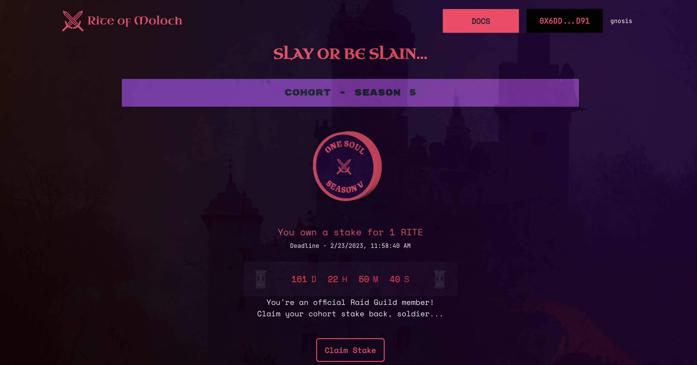

# How to use Rite of Moloch as a cohort member and what to expect.

--- 
description: Do you have what it takes? Defend yourself from Moloch. Reclaim your jewels.
---

## Join a Cohort

### What is a RaidGuild cohort?

The cohort program allows groups of new initiates to participate in a series of onboarding sessions called a season. Cohort members will learn what RaidGuild entails, projects the guild is currently working on, and prepare to participate in raids.

You must be invited to join RaidGuild by a current member.

### What happens during the cohort season?

A combination of synchronous and asynchronous activity will occur for 3-4 weeks. Each season may vary as we evolve and improve, but they typically include:

* Information sessions
* Cohort member introductions
* Team building
* Role Identification
* Cohort Raid formation
* Completion of a cohort team project

## Preventing Slashing

### How to prevent slashing**

**First**, you joined the cohort for a reason, so participate and contribute in order to learn all that RaidGuild has to offer. Cohort-specific team projects will be your starting point for participation.

**Second**, be brave. Work with willing RaidGuild members to help them on projects they present. Come up with new ideas for RaidGuild. Offer your services and contribute proactively where you can.

**Finally**, your initiation as a RaidGuild member will require an existing member to invite you. At this point, you will have the ability to reclaim your staked tokens.

## Claim Stake

Should you be granted RaidGuild membership then you will be allowed to claim your stake back from the cohort.

<figure><figcaption>
Congratulations Solider, Let's Slay some Moloch
</figcaption></figure>
