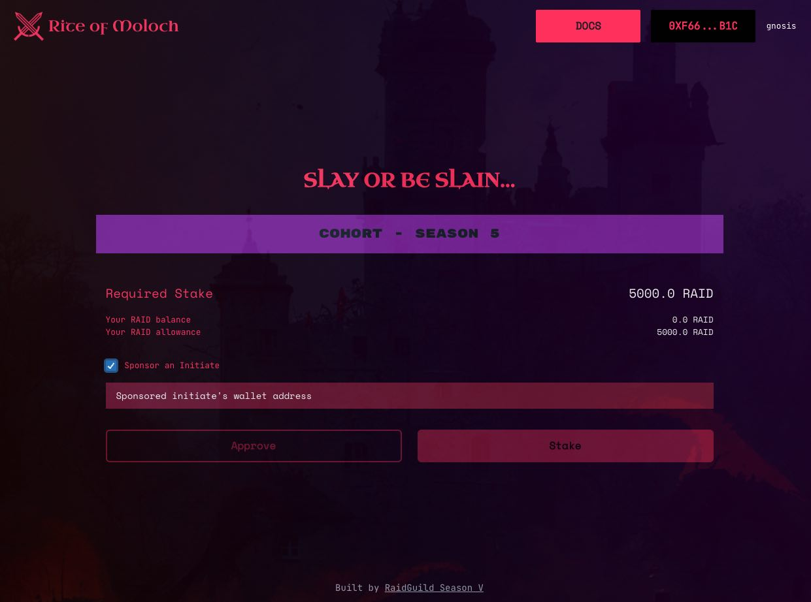

# Sponsor Initiate

The Rite of Moloch allows anyone to sponsor an initiate to the cohort, effectively providing a grant for the participant.  This enables participants with low or restricted financial resources the ability to join the cohort.  If the sponsored contributor successfully joins the DAO - they are able to claim the tokens and get paid!

### How to Sponsor

1. Connect your wallet to the [Rite of Moloch dApp](http://initiate-rite.xyz)
2. Check of "Sponsor an initiate"
3. Add the initiate's wallet address
4. Approve require staking amount
5. Stake funds

<figure><figcaption></figcaption></figure>
