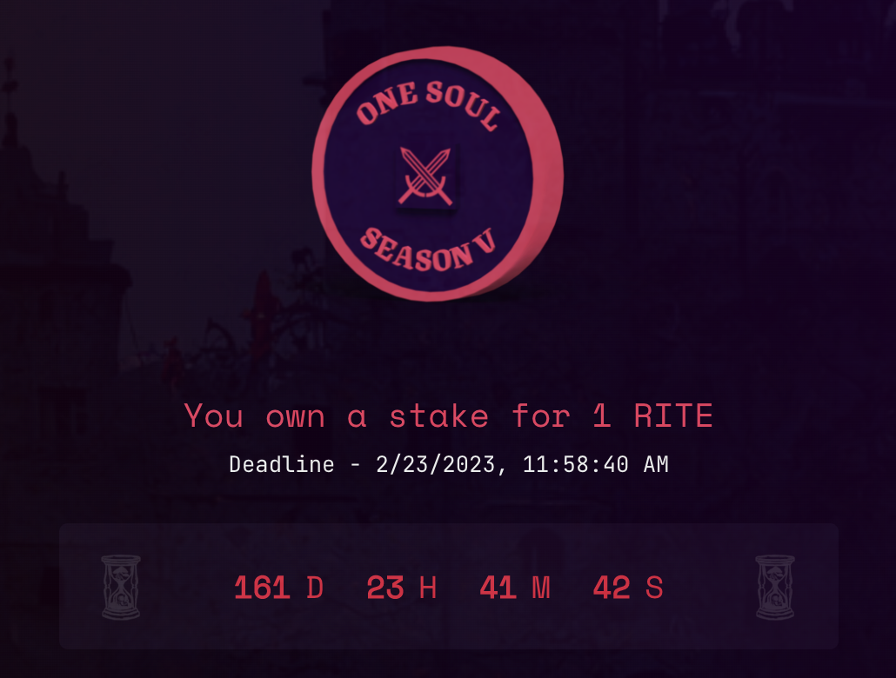

# Expiration Timer

### Why is there a timer?

After you stake to be initiated into the cohort and receive your SBT, you will have a designated time to be initiated as a Raid Guild member.

The allotted time is recorded on-chain in the Rite Of Moloch contract.

When the timer expires the Raid Guild can choose to slash your cohort membership forfeiting your stake.

Slay or be slain.

<figure><figcaption></figcaption></figure>
