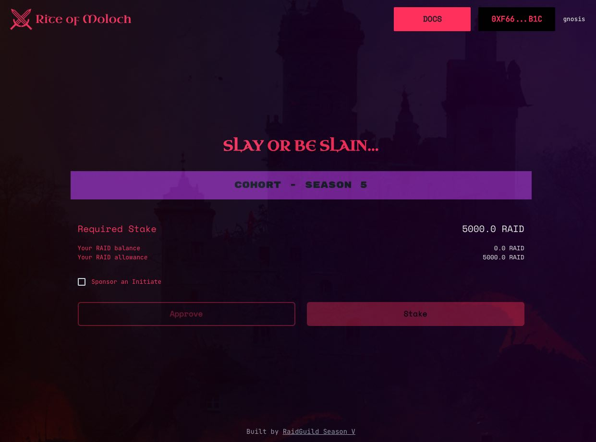

# Stake to Initiate

As a new member joining a cohort you'll be required to add some skin in the game by staking a token to join the cohort.

### **Why?**

DAOs invest time and resources into cohort programs with the hopes of onboarding new members. To encourage serious participation and time wasted, the Rite Of Moloch dApp allows initiates to show they are serious about joining Raid Guild.

### What is at stake?

The stake is used to claim the cohort SBT and solidify accountability to the group. Should the initiate fail to participate in the cohort or drop out, that stake is at risk of being slashed and moved to the Raid Guild treasury.

This can only have after the [expiration time](expiration-timer.md) has passed.

### Soul Bound Token (SBT)

Upon successfully staking the required tokens, the initiate will receive one Soul Bound Token. This token validates that they have staked the required tokens in order to participate in the current or upcoming cohort season and is non-transferable.

This token will be used to grant access within the [discord](https://discord.gg/raidguild) to the cohort-specific channels.


What is a Soul Bound Token (SBT)?

* NFT where the transfer functions have been overwritten so they revert
* Once minted, an SBT cannot be transferred to a different address.
* Stake to join a cohort and receive SBT token
  * SBT is an on-chain achievement for joining the cohort
  * NFT functions as an access pass to token gated discord and resources


### How to Stake and Receive a SBT

1. Go to [initiate-rite.xyz](http://initiate-rite.xyz)
2. Select **Connect** to connect your wallet. Confirm you are on the Gnosis blockchain
3. Confirm the asset and amount required to stake
4. Select **Approve** and sign the transaction to allow staking the required amount.
5. Select **Stake** and sign the transaction to stake your tokens. A confirmation will show with SBT token and expiration timer
6. May the force be with you


You can bridge DAI from Ethereum to Gnosis Chain using the [Gnosis Bridge](https://bridge.gnosischain.com/) and then swap to your token of choice using [Honeyswap](https://honeyswap.org/).


<figure><figcaption></figcaption></figure>
